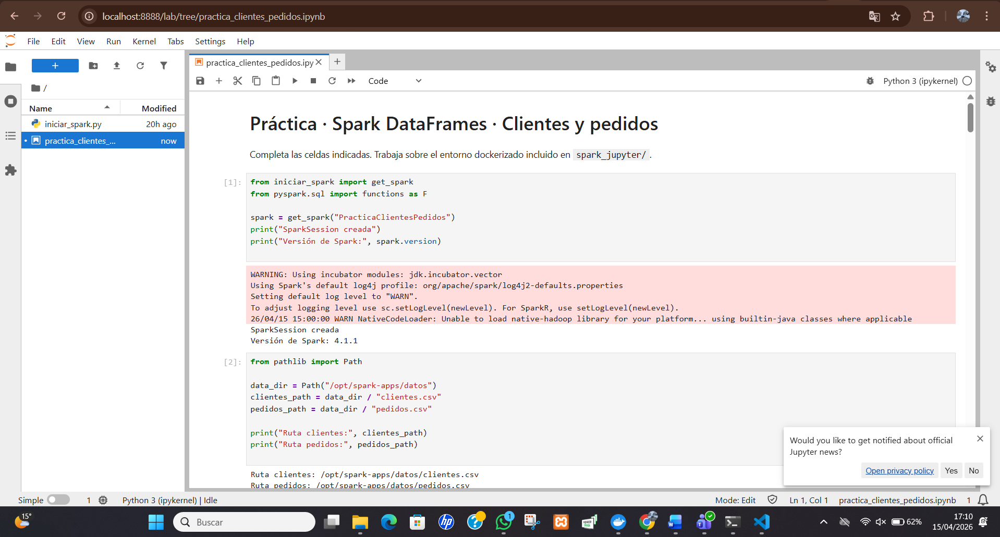
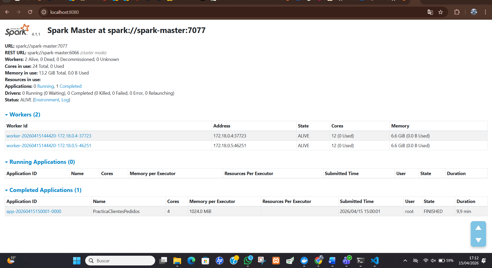
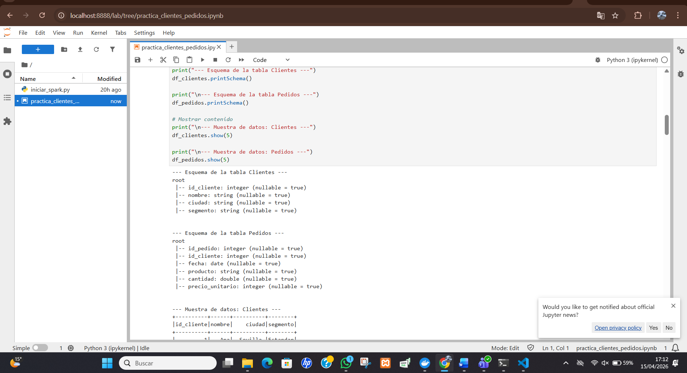
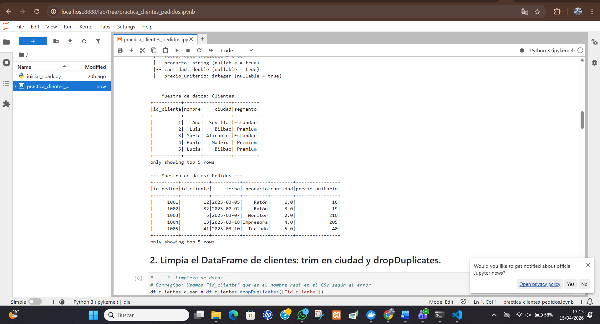
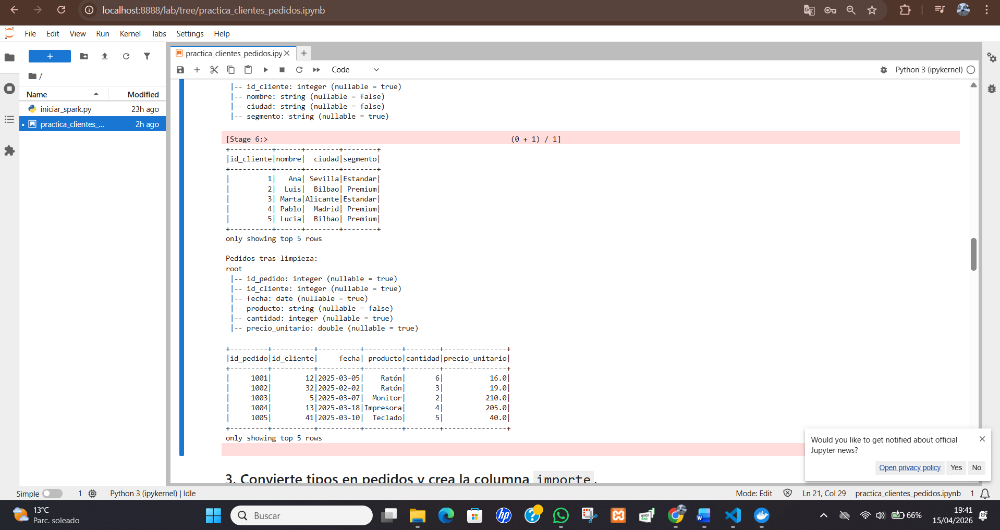
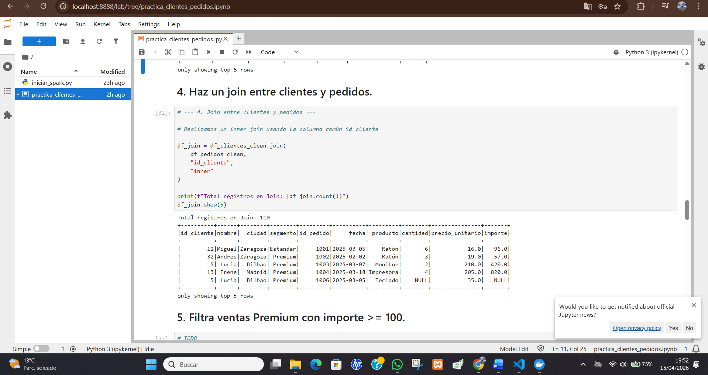
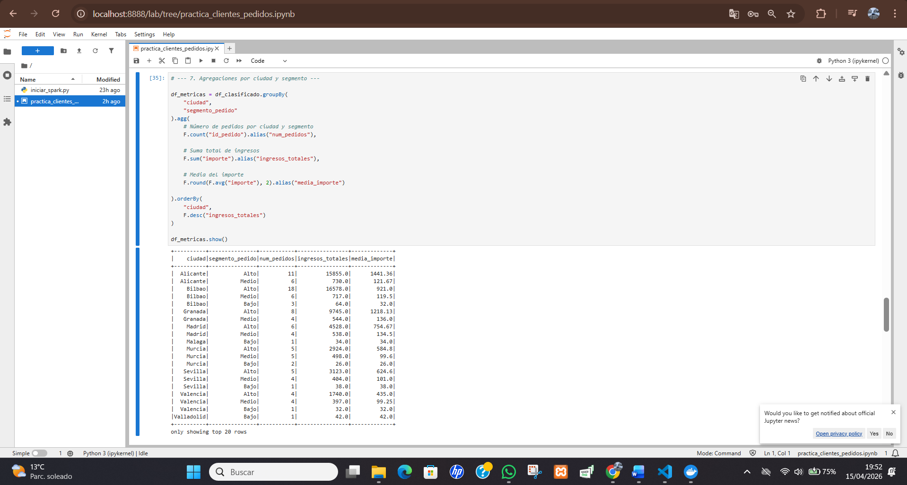
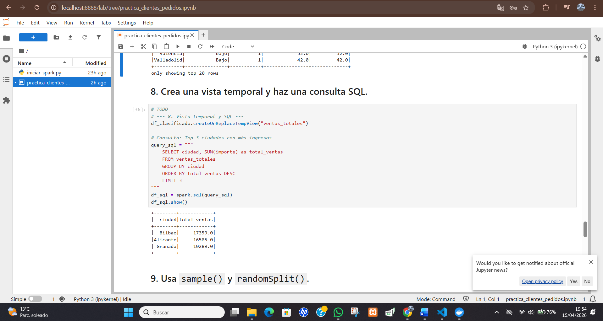
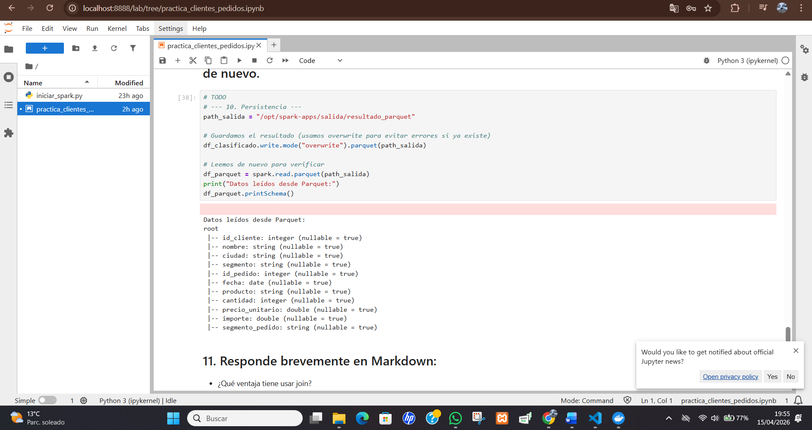
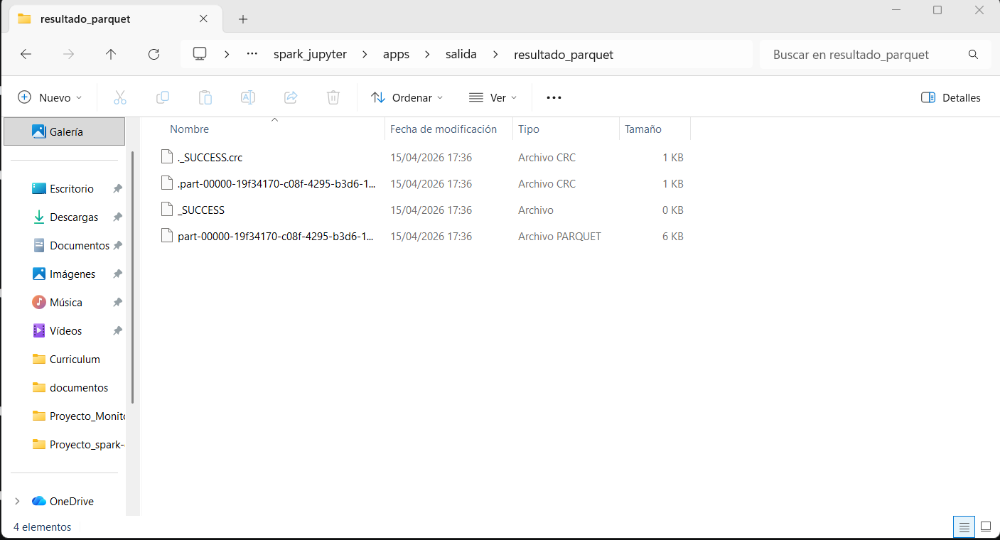

# Evidencias de la práctica

Incluye aquí capturas o salidas relevantes del cuaderno.

## 1. Entorno levantado
- Captura de JupyterLab

- Captura del Spark Master UI

## 2. Lectura de datos
- Esquema de `clientes`
- Esquema de `pedidos`

- Muestra inicial de datos

## 3. Limpieza
- Resultado tras `trim`
- Eliminación de duplicados
- Tratamiento de valores nulos

## 4. Join
- Resultado del join entre clientes y pedidos
- Explicación breve de los registros perdidos

En el inner join se pierden los registros cuyo id no aparece en ambas tablas. Esto ocurre porque solo conserva filas con coincidencia exacta en la clave de unión.

## 5. Agregaciones
- Resumen por ciudad y segmento
- Interpretación breve de los resultados

Los resultados muestran que las ciudades con segmento “Alto” concentran más pedidos y mayores ingresos, como Bilbao y Alicante.
En cambio, los segmentos “Medio” y “Bajo” tienen menos pedidos y menor importe promedio, reflejando menor actividad comercial.

## 6. SQL
- Consulta SQL realizada
- Resultado obtenido

## 7. Parquet
- Escritura del resultado
- Lectura posterior del fichero Parquet

